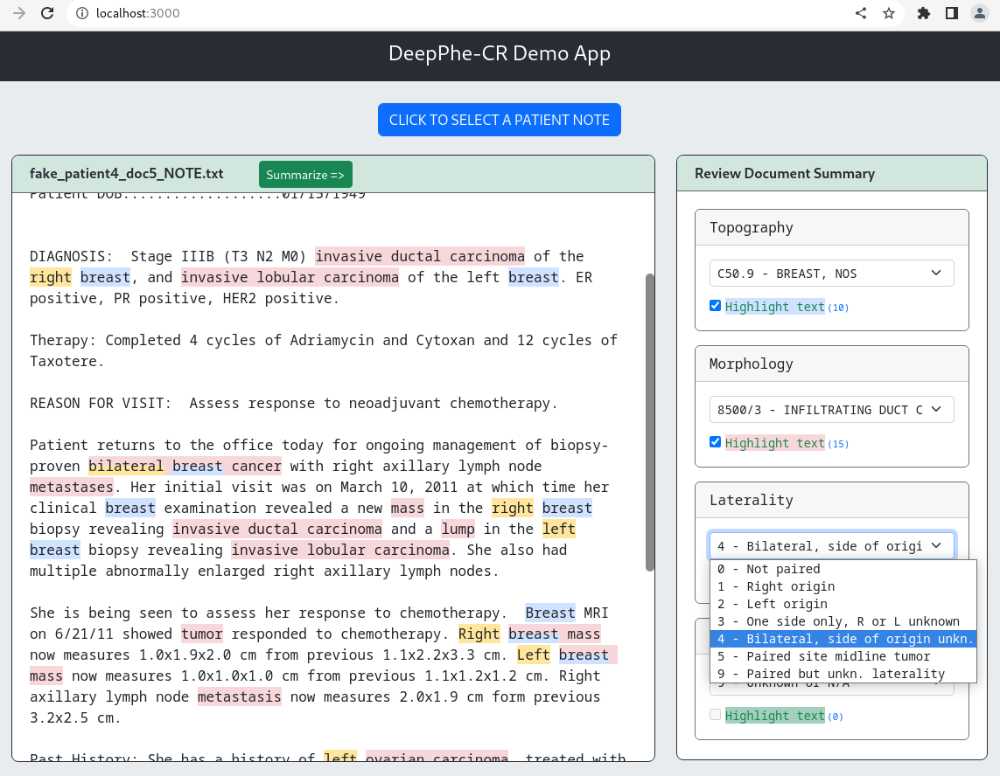

# DeepPhe-CR Demonstration Application

A simple React web application designed to demonstrate the capabilities of the DeepPhe-CR tools. This app will be based on the integration of DeepPhe-CR into CPDMS, as developed by KCR. The backend REST API service is provided through the [DeepPhe Stream Multi-Container Stack](https://github.com/DeepPhe/dphe-stream-dock) project.

## Install

If you don't have Nodejs installed, first install the Nodejs v18 (includes npm). If you'll work with multiple Nodejs version, install [Node Version Manager](https://github.com/nvm-sh/nvm) (nvm) first then install Nodejs v18 via nvm.

Then in the root directory of this project, run `npm install` to install all the application dependencies.

## Start up the demo app

First make sure the backend [DeepPhe Stream Multi-Container Stack](https://github.com/DeepPhe/dphe-stream-dock) is up running. This demo app will be making API calls against the containers which runs the NLP pipeline to extract all the information.

Back in the demo project directory, run `npm start` and it'll open the app at [http://localhost:3000](http://localhost:3000) in your web browser.

## Sample patient reports

This demo app comes with [sample reports](reports) from several fake patients for the demonstration purposes.

